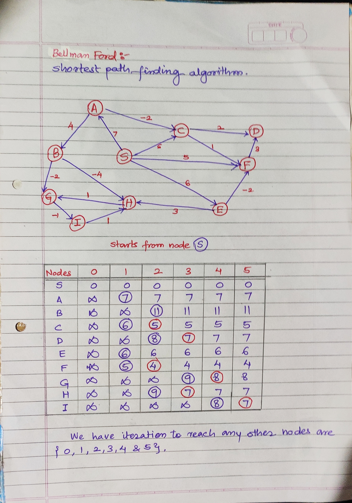

## Bellman-Ford Algorithm

It is mainly used to find the shortest path in graph.

In the attached image we have to find shortest path form node **S**, the table in the image shows the weightage of
traversing from node **S** to other nodes {**A**, **B**, **C**, **D**, **E**, **F**, **G**, **H**, **I**}.

In each iteration we are increasing node traversing steps, like in **iteration-1**, we can only traverse one node and
try to reach target node, if possible to reach then that value is listed in the table, otherwise we display **infinity**
symbol.

In this process on any point if we find the weightage of traversing from source node to target node is less than the previous entry
we override it with minimum values, for example in **iteration-1** we can reach **C** from **S** as {S -> A} path with weightage of **6**, but in **iteration-2** we can observe another way to reach **C** from **S** as {S->A->C} with weightage of **5** (7 + (-2)). So we will replace the previous value with latest minimum value.

In the same way we keep on increasing the depth of iteration, till we  reach the maximum-depth of graph.

In last iteration we will get all shortest path and its weightage to reach target node.

---

